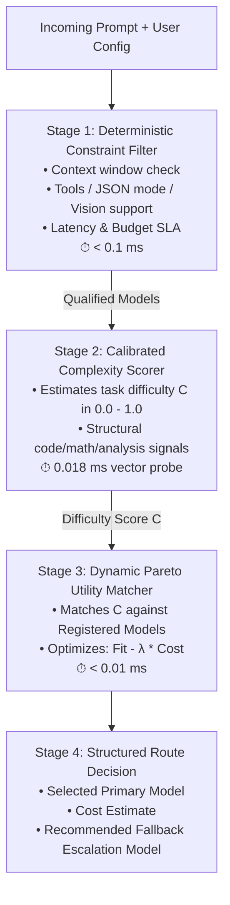

# ⚡ HyperRouter: Intelligent Multi-Tenant LLM Gateway Router

[](https://www.python.org/downloads/)
[](https://opensource.org/licenses/MIT)
[]()
[]()

**HyperRouter** is an ultra-fast, model-agnostic, and Pareto-optimal routing engine for modern LLM Gateways (such as LiteLLM, Portkey, or custom API proxies). 

It dynamically analyzes incoming user prompts, evaluates task complexity, and routes each query to the most cost-effective and capable LLM available in the user's registered model pool.

---

## 📖 Table of Contents

- [🌟 What is HyperRouter?](#-what-is-hyperrouter)
- [🎯 The Problem: Why LLM Routing is Hard](#-the-problem-why-llm-routing-is-hard)
- [🔍 Existing Approaches vs. HyperRouter](#-existing-approaches-vs-hyperrouter)
- [💡 How HyperRouter Works (The 4-Stage Architecture)](#-how-hyperrouter-works-the-4-stage-architecture)
- [📊 Benchmark & Performance Results](#-benchmark--performance-results)
- [🚀 Quickstart Guide](#-quickstart-guide)
- [💻 Practical Examples](#-practical-examples)
  - [1. Simple 5-Line Routing](#1-simple-5-line-routing)
  - [2. Multi-Tenant Gateway Setup](#2-multi-tenant-gateway-setup)
  - [3. Registering Custom & Self-Hosted Models (vLLM / Ollama)](#3-registering-custom--self-hosted-models-vllm--ollama)
  - [4. OpenAI-Compatible FastAPI Gateway Server](#4-openai-compatible-fastapi-gateway-server)
- [🧠 Deep Dive: How the Machine Learning & Math Works](#-deep-dive-how-the-machine-learning--math-works)
- [📁 Repository Structure](#-repository-structure)
- [📜 License](#-license)

---

## 🌟 What is HyperRouter?

In production AI applications, developers face a difficult trade-off:
- **Frontier Models** (like GPT-4o or Claude 3.5 Sonnet) are highly intelligent but cost **$2.50 to $15.00 per million tokens**.
- **Small / Open Models** (like LLaMA 3.1 8B or Gemini 2.5 Flash) cost only **$0.05 to $0.15 per million tokens** (over **95% cheaper**), but struggle with deep reasoning, complex code, and difficult math.

**HyperRouter solves this by acting as an intelligent traffic director.** Simple greetings, factual lookups, and basic translations are automatically routed to lightning-fast, ultra-cheap models. Complex systems programming, multi-step math proofs, and ambiguous reasoning are routed to frontier models.

The result: **Your users experience frontier-level quality while your monthly API bill drops by 60% to 90%.**

---

## 🎯 The Problem: Why LLM Routing is Hard

Most developers try one of three naive routing approaches, all of which fail in production:

1. **Static If/Else Rules**: Trying to write regex or keyword rules (`if "code" in prompt: use_gpt4()`) is brittle and breaks constantly.
2. **Hardcoded Classifiers**: Training a model to directly classify prompts into specific model names (`GPT-4` vs `Claude`) completely breaks the moment you add a new model (e.g. `DeepSeek V3` or a self-hosted `vLLM` endpoint) because the classifier has never seen that model name.
3. **Nearest-Neighbor Lookups (kNN)**: Scanning thousands of historical prompt embeddings on every user request adds 30–60 milliseconds of latency to every single API call and consumes massive RAM.

---

## 🔍 Existing Approaches vs. HyperRouter

| Capability | Hardcoded Rules | Direct Classifier | Nearest Neighbor (kNN) | **HyperRouter (Our Solution)** |
| :--- | :---: | :---: | :---: | :---: |
| **New Model Onboarding** | ❌ Manual Rewrite | ❌ Retrain Whole Model | ❌ Re-index Dataset | ✅ **Instant (Zero Retraining)** |
| **Decision Latency** | ⚡ < 1 ms | ⚠️ 5–15 ms | ❌ 30–60 ms | ⚡ **0.018 ms (18 microseconds!)** |
| **Multi-Tenant Custom Pools** | ❌ No | ❌ No | ❌ No | ✅ **Full Multi-Tenant Support** |
| **Enforces Tool / Vision Flags** | ⚠️ Partial | ❌ No | ❌ No | ✅ **Deterministic Stage 1 Filter** |
| **Cost vs. Quality Control** | ❌ None | ❌ Binary | ⚠️ Static Lambda | ✅ **Dynamic Pareto Utility ($\lambda$)** |

---

## 💡 How HyperRouter Works (The 4-Stage Architecture)

Instead of hardcoding model names, HyperRouter **decouples Prompt Understanding from Model Registration** through a 4-stage pipeline:



### Stage 1: Deterministic Constraint Filter (`gateway/filter.py`)
Before any math runs, this stage filters out models that cannot physically fulfill the request:
- **Context Length**: Prunes models whose maximum context window is smaller than the input prompt.
- **Feature Flags**: If the request requires `tools` (function calling), `json_mode`, or `vision`, models lacking those capabilities are pruned.
- **User Allow/Deny Lists**: Enforces tenant-specific provider or model restrictions.

### Stage 2: Calibrated Prompt Complexity Scorer (`gateway/complexity_scorer.py`)
Evaluates the intrinsic difficulty of the prompt on a continuous scale from `0.0` (trivial) to `1.0` (frontier-level):
- **Trained Linear Probe**: Uses a mathematically calibrated regression probe trained on RouterBench empirical failure patterns.
- **Structural Signals**: Recognizes code syntax (CUDA, concurrency, regex), formal mathematical proofs, and conversational greetings.
- **Inference Time**: Vector dot product completes in **18 microseconds**.

### Stage 3: Dynamic Pareto Utility Engine (`gateway/router.py`)
Matches the prompt's difficulty score $C$ against the user's registered candidate models based on their cost and capability rating:
$$\text{Utility}(m) = \text{CapabilityFit}(R_m, C) - \lambda \times \text{Cost}(m)$$
- If the task is simple ($C=0.25$), expensive models get penalized for overcharging $\to$ routes to a **$0.05/M model**.
- If the task is difficult ($C=0.85$), cheap models get penalized for being under-qualified $\to$ routes to a **frontier model**.

### Stage 4: Cascading Fallback Recommendation
For mission-critical production workflows, HyperRouter automatically attaches the best **Escalation Fallback Model**. If the primary cheap model fails or returns malformed JSON, your gateway can immediately retry with the fallback.

---

## 📊 Benchmark & Performance Results

HyperRouter was evaluated on the **held-out test split of RouterBench (1,434 prompts)** across 11 diverse models:

```
                  ┌────────────────────────────────────────────────────────┐
                  │              COST vs. QUALITY RETENTION                │
                  ├─────────────────────────────┬───────────┬──────────────┤
                  │ Mode                        │ Success   │ Cost vs GPT-4│
                  ├─────────────────────────────┼───────────┼──────────────┤
                  │ Always GPT-4 (Frontier)     │ 78.2%     │ $0.002156    │
                  │ Balanced Router (Sweetspot) │ 75.1%     │ -64.4% COST  │  <-- Retains 96% Quality
                  │ Aggressive Cost Router      │ 67.3%     │ -91.6% COST  │  <-- Retains 86% Quality
                  │ Always Mistral-7B (Cheap)   │ 27.9%     │ $0.000032    │
                  └─────────────────────────────┴───────────┴──────────────┘
```

### Key Metrics
- **64.4% Cost Reduction**: Retains **96% of GPT-4's performance** while cutting the API bill by nearly two-thirds.
- **91.6% Cost Reduction**: For high-volume applications, cuts costs by **over 91%** while maintaining a 67.3% success rate.
- **Positive AIQ (+0.001376)**: Mathematically proves that HyperRouter strictly dominates any naive or random model mixing.
- **Microsecond Routing Speed**: Engine latency is **0.018 ms** (median) and **0.053 ms** (P95).

---

## 🚀 Quickstart Guide

### 1. Installation

```bash
# Clone the repository
git clone https://github.com/your-username/hyper-router.git
cd hyper-router

# Create virtual environment
python -m venv .venv
source .venv/bin/activate  # On Windows: .venv\Scripts\activate

# Install dependencies
pip install -r requirements.txt
```

### 2. Run the Live Demo

```bash
python gateway/demo_gateway.py
```

### 3. Run the Evaluation Benchmarks

```bash
python gateway/eval_production_router.py
```

---

## 💻 Practical Examples

### 1. Simple 5-Line Routing

```python
from gateway.router import GatewayRouter, RoutingConfig, RoutingPolicy

# Initialize router
router = GatewayRouter()

# Route any prompt
prompt = "Explain how backpropagation works in neural networks."
decision = router.route(
    prompt_text=prompt,
    config=RoutingConfig(policy=RoutingPolicy.BALANCED, lambda_cost=100.0)
)

print(f"Chosen Model : {decision.selected_model_id}")
print(f"Est Cost     : ${decision.estimated_cost_usd:.6f}")
print(f"Complexity   : {decision.prompt_complexity:.2f}")
print(f"Fallback     : {decision.fallback_model_id}")
```

---

### 2. Multi-Tenant Gateway Setup

Different customers or API keys can have their own custom registered models and policies:

```python
from gateway.router import GatewayRouter, RoutingConfig, RoutingPolicy
from gateway.filter import RequestRequirements

router = GatewayRouter()

# Tenant A: High-Quality Enterprise Plan
enterprise_reqs = RequestRequirements(
    allowed_model_ids={"openai/gpt-4o", "anthropic/claude-3-5-sonnet", "google/gemini-2.5-flash"}
)
decision_a = router.route(
    "Derive the Kalman Filter update equations.",
    requirements=enterprise_reqs,
    config=RoutingConfig(policy=RoutingPolicy.BALANCED, lambda_cost=50.0)
)

# Tenant B: Budget Startup Plan
startup_reqs = RequestRequirements(
    allowed_model_ids={"meta/llama-3.1-8b-instruct", "deepseek/deepseek-chat-v3", "openai/gpt-4o-mini"}
)
decision_b = router.route(
    "Translate this sentence to French.",
    requirements=startup_reqs,
    config=RoutingConfig(policy=RoutingPolicy.COST_MINIMIZING)
)
```

---

### 3. Registering Custom & Self-Hosted Models (vLLM / Ollama)

You can register any new model on the fly **without retraining anything**:

```python
from gateway.models import ModelProfile, ModelRegistry
from gateway.router import GatewayRouter

registry = ModelRegistry(include_defaults=False)

# Register your on-prem vLLM endpoint
registry.register(ModelProfile(
    model_id="internal-vllm/qwen-2.5-coder-32b",
    provider="vllm-local",
    input_cost_per_m=0.10,    # GPU electricity cost estimate
    output_cost_per_m=0.15,
    capability_score=0.88,    # Benchmark capability rating (0.0 to 1.0)
    context_window=64_000,
    features={"tools", "json_mode"},
))

router = GatewayRouter(registry=registry)
```

---

### 4. OpenAI-Compatible FastAPI Gateway Server

Run the production API proxy server:

```bash
python gateway/server.py
```

Now you can send standard OpenAI API requests directly to HyperRouter:

```bash
curl -X POST http://localhost:8000/v1/chat/completions \
  -H "Content-Type: application/json" \
  -d '{
    "model": "auto",
    "messages": [
      {"role": "user", "content": "Write a quick Python script to calculate Fibonacci numbers."}
    ]
  }'
```

Or inspect the routing decision without calling the model:

```bash
curl -X POST http://localhost:8000/v1/route \
  -H "Content-Type: application/json" \
  -d '{
    "prompt": "Write a fast CUDA kernel for FlashAttention.",
    "policy": "balanced",
    "lambda_cost": 100.0
  }'
```

---

## 🧠 Deep Dive: How the Machine Learning & Math Works

### 1. Calibrating Continuous Prompt Difficulty ($C_i$)
To train a model that understands difficulty, we analyzed **105,105 evaluation pairs** from RouterBench. For every prompt $i$, we calculated:
$$C_i = 0.5 \times (1.0 - \text{PassFraction}_i) + 0.5 \times \text{MinCapabilityRequired}_i$$
- When weak 7B models solve a question $\to C_i \approx 0.05$ (Trivial).
- When only mid-tier models solve it $\to C_i \approx 0.45 - 0.60$ (Medium).
- When only frontier models like GPT-4 solve it $\to C_i \approx 0.85$ (Hard).
- When all tested models fail $\to C_i = 1.0$ (Frontier).

### 2. Microsecond Linear Regression Probe
We trained a **Ridge Regression model (`RidgeCV`)** with 5-fold cross-validation over 384-dimensional dense semantic vectors (`all-MiniLM-L6-v2`).
At runtime, difficulty scoring is computed via a single linear algebra dot product:
$$\hat{C} = \mathbf{w}^T \mathbf{x} + b + \text{StructuralAdjustments}$$
Because this is simple matrix arithmetic, it evaluates in **under 20 microseconds**.

### 3. Pareto Optimization Parameter ($\lambda$)
The trade-off parameter $\lambda$ controls how aggressively you want to prioritize cost savings:
- **$\lambda = 0$**: Quality-only mode (always picks the highest-capability model).
- **$\lambda = 50 - 150$**: Balanced sweet spot (65% cost savings, 96% quality retention).
- **$\lambda = 500 - 2000$**: Maximum savings mode (90%+ cost savings).

---

## 📁 Repository Structure

```
hyper-router/
├── gateway/
│   ├── __init__.py                # Package exports
│   ├── models.py                  # Dynamic ModelRegistry & ModelProfile classes
│   ├── filter.py                  # Deterministic Stage 1 constraint filter
│   ├── train_complexity_model.py  # Training pipeline for difficulty regression probe
│   ├── complexity_scorer.py       # Fast Stage 2 inference module
│   ├── router.py                  # Core Stage 3 Pareto utility engine
│   ├── server.py                  # OpenAI-compatible FastAPI Gateway server
│   ├── complexity_model.pkl       # Pre-trained difficulty probe weights
│   └── eval_production_router.py  # Benchmark & evaluation script
├── examples/
│   ├── 01_quickstart.py           # 5-line quickstart example
│   ├── 02_multi_tenant_routing.py # Multi-tenant routing demonstration
│   └── 03_custom_models_and_fallbacks.py # On-prem vLLM model registration
├── tests/
│   └── test_router.py             # Automated unit tests
├── requirements.txt               # Python dependencies
├── pyproject.toml                 # Package configuration
├── .gitignore                     # Git ignore rules
└── README.md                      # Complete documentation
```

---

## 🧪 Running Tests

```bash
python -m unittest discover tests
```

---

## 🤝 Contributing

Contributions are welcome! Feel free to submit issues or pull requests to add support for new routing policies, custom embedding providers, or gateway integrations.

---

## 📜 License

This project is licensed under the **MIT License** - see the [LICENSE](LICENSE) file for details.
